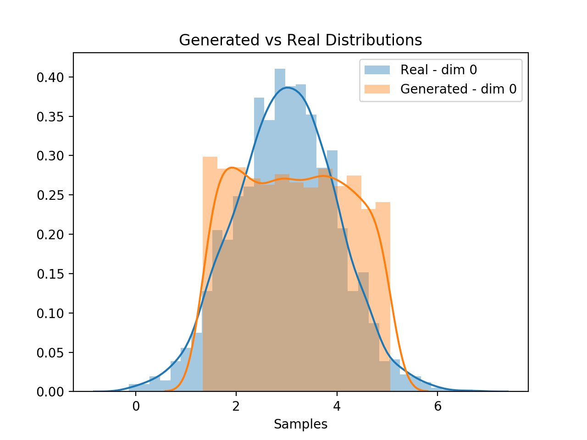
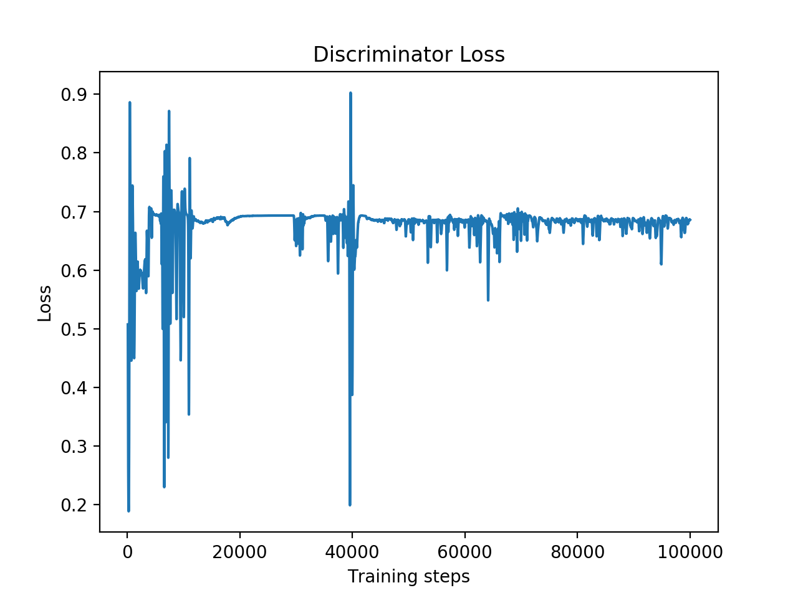
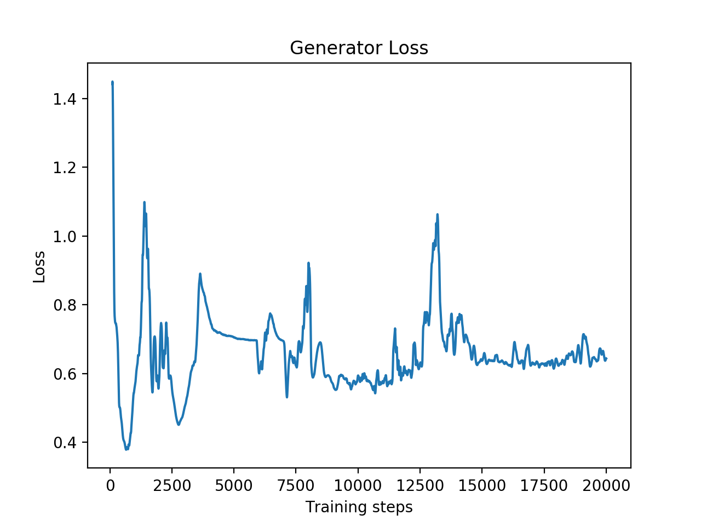
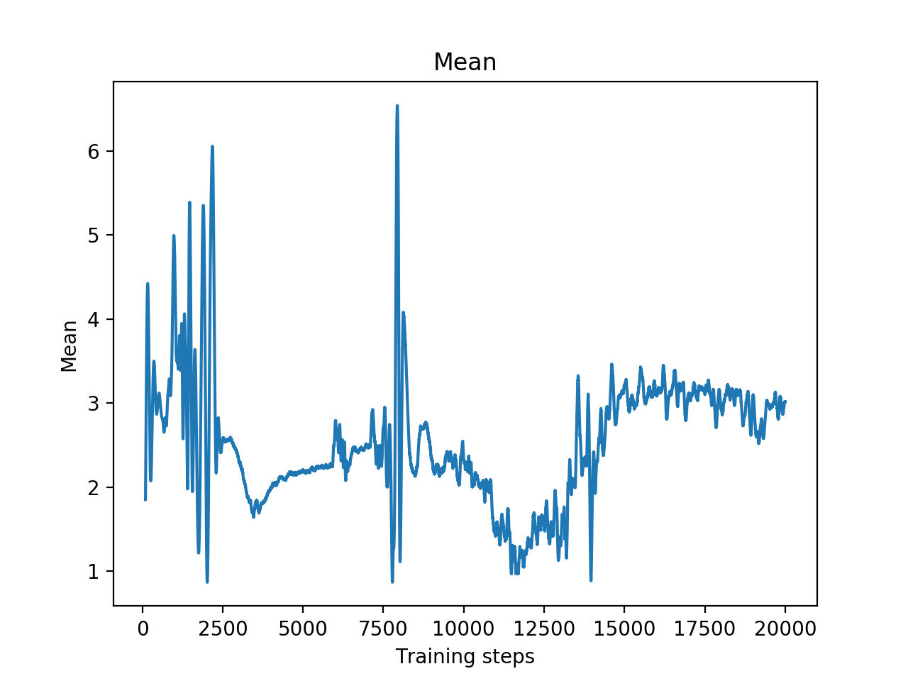

# GANs_pytorch
In this repository I implement several versions of Generative Adversarial Networks in PyTorch.

All comments and discussions are welcome.

# Vanilla GANs
In this section I implemented the original version of GANs as described in [this paper](https://arxiv.org/abs/1406.2661) by Ian J. Goodfellow, Jean Pouget-Abadie, Mehdi Mirza, Bing Xu, David Warde-Farley, Sherjil Ozair, Aaron Courville, Yoshua Bengio

## Experiment setup
The target distribution was a Normal distribution with mean=3 and std=1, and the input noise to the generator was sampled from a uniform distribution. Both the target and noise samples are monodimensional, but this can be changed in the config.yml file in order to extend to multiple dimensions.

The discriminator is composed by 3 hidden layers with 16, 16 and 8 neurons respectively, with ReLU activation functions and dropout after each layer with a probability of 0.5. The output layer is composed by only 1 neuron with sigmoid activation function, providing the probability of the input sample belonging to the real distribution and not being generated by the generator.

The generator is composed by 3 hidden layers of sizes 16, 32, 16 relatively, with ReLU activation functions. The output layer has the same size of the number of dimensions of the target samples, so in our case is 1. The output activation function is linear, because we don't want to limit the output values.

## Results
Here some results are reported after training for 20k steps.

The training of the two networks was quite unstable and with high variance, where different runs with the same setup but different initializations produced very different results in some cases. A possible next step could be to reduce the size of the networks (reducing the number of neurons per layer or the number of layers) in order to obtain more stable models.

Below are reported some charts of the results of the experiment. As you can see, the generator matched the range and the mean of the real data distribution, even if it's not perfectly getting the good bell shape.  

Discriminator Loss                                           |  Generator Loss
:-----------------------------------------------------------:|:---------------------------------------:
 | 

As we can see, the generator was able to catch the real mean of the data after around 15k steps.  

# Convolutional GANs - Work in Progress
This is an extension of the Vanilla GANs developed in the previous section. It can be seen as an exercise and preparation to the latest and more advanced GANs that have been introduced in the last years.

The idea is to extend the previous implementation to use Convolutional Neural Networks for the generation of images.