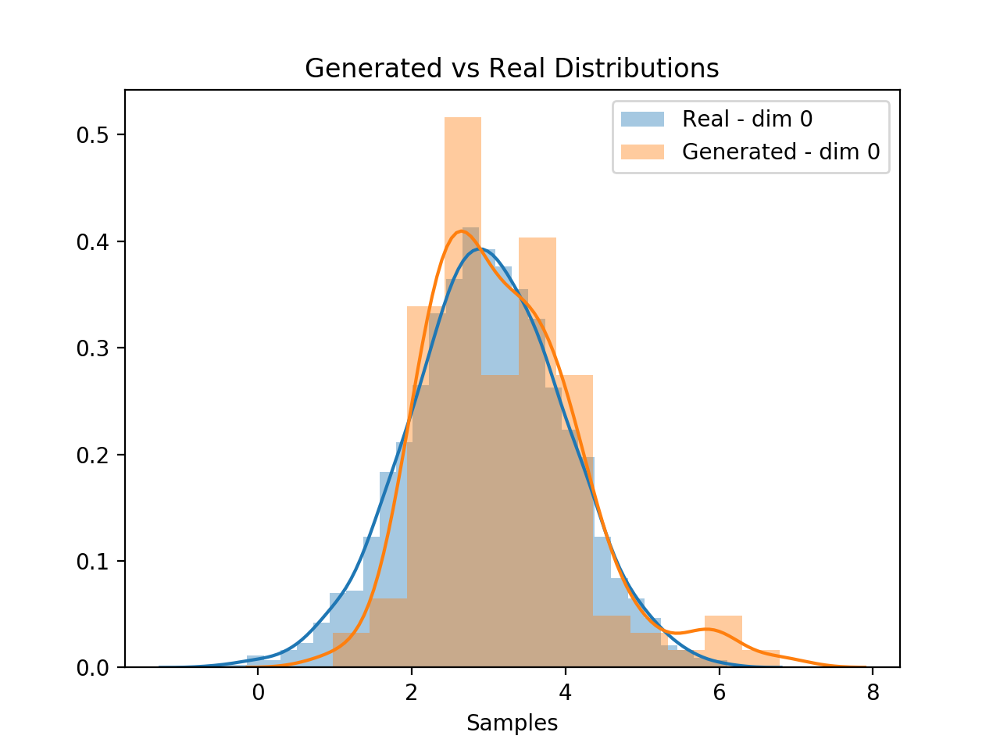
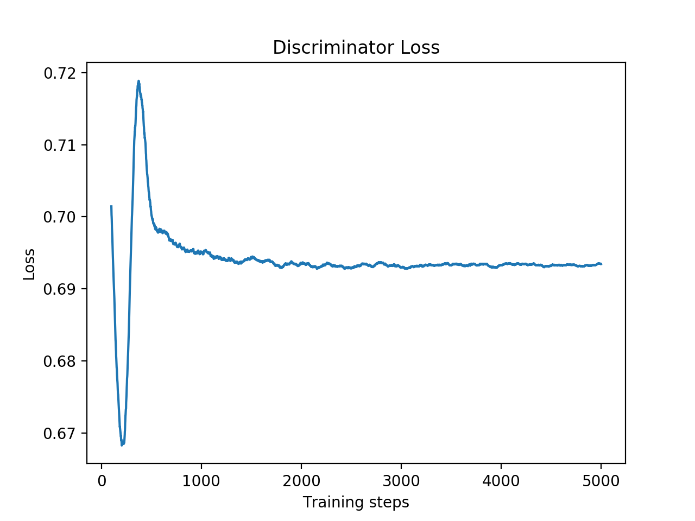
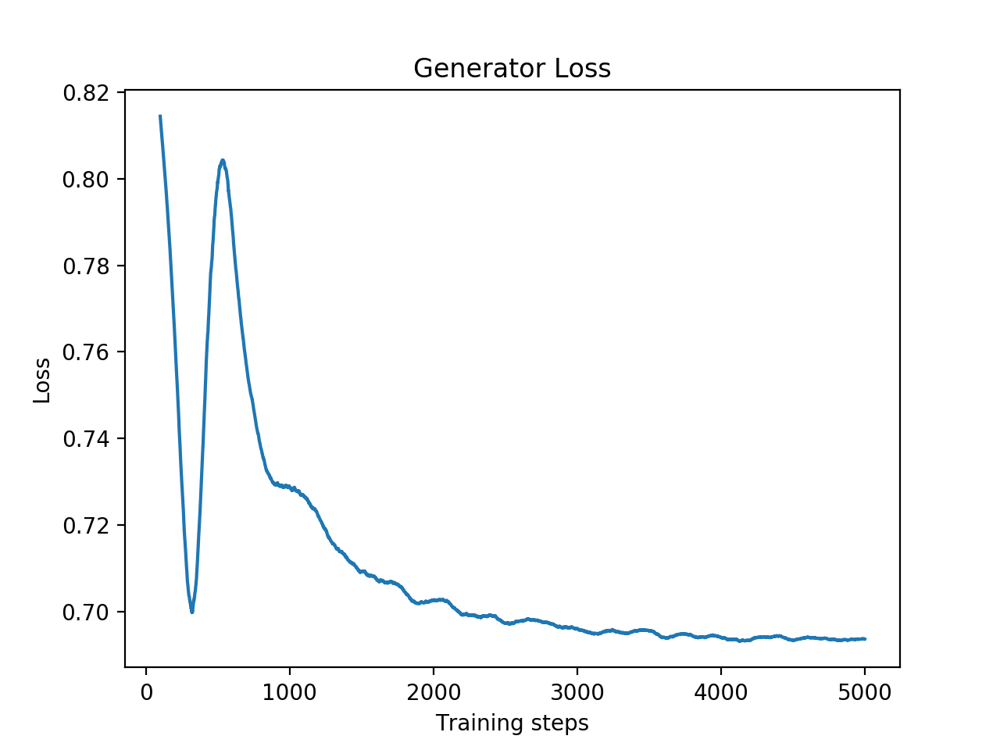
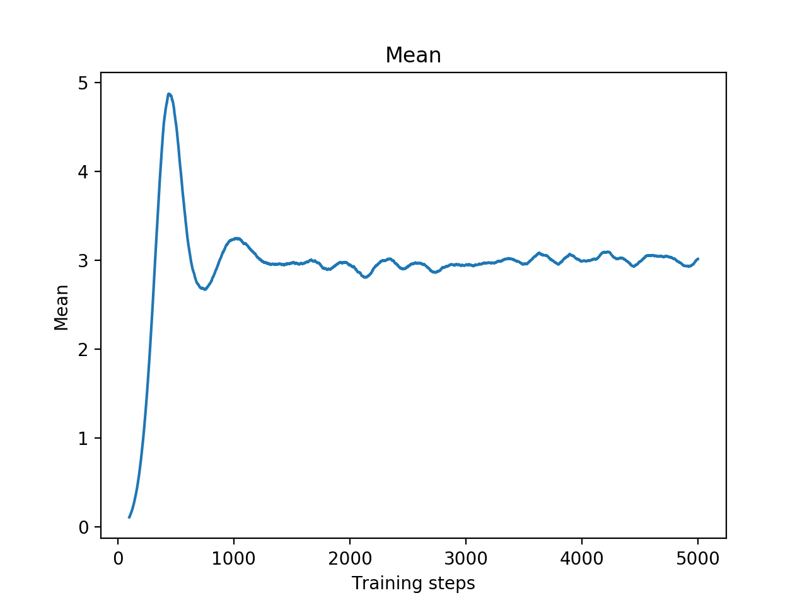
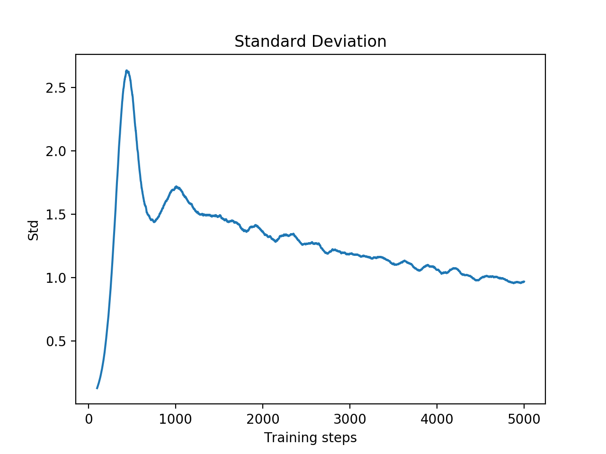
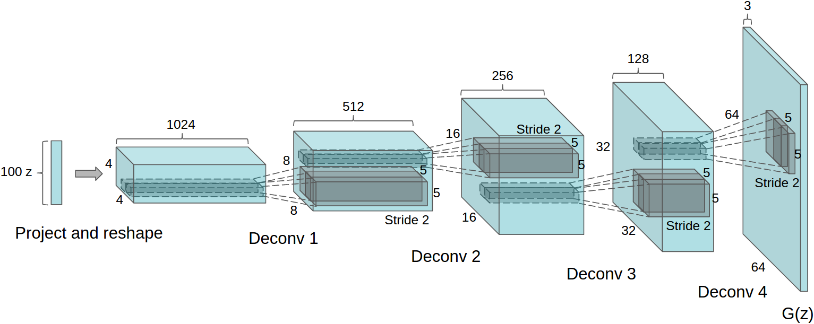
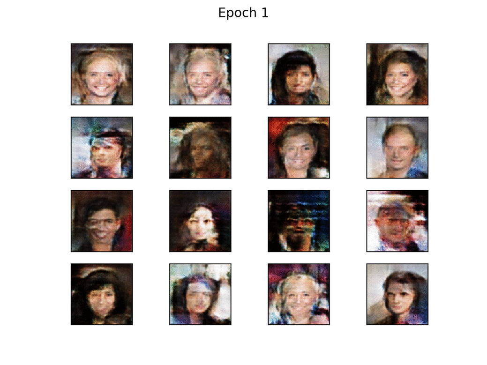

# GANs in PyTorch
In this repository I implement several versions of Generative Adversarial Networks in PyTorch.

All comments and discussions are welcome.

# GAN
In this section I implemented the original version of GAN as described in [this paper](https://arxiv.org/abs/1406.2661) by Ian J. Goodfellow, Jean Pouget-Abadie, Mehdi Mirza, Bing Xu, David Warde-Farley, Sherjil Ozair, Aaron Courville, Yoshua Bengio

## Experiment setup
The target distribution was a Normal distribution with mean=3 and std=1, and the input noise to the generator was sampled from a uniform distribution. Both the target and noise samples are monodimensional, but this can be changed in the config.yml file in order to extend to multiple dimensions.

The discriminator is composed by 3 hidden layers with 16, 16 and 8 neurons respectively, with ReLU activation functions and dropout after each layer with a probability of 0.5. The output layer is composed by only 1 neuron with sigmoid activation function, providing the probability of the input sample belonging to the real distribution and not being generated by the generator.

The generator is composed by 3 hidden layers of sizes 16, 32, 16 relatively, with ReLU activation functions. The output layer has the same size of the number of dimensions of the target samples, so in our case is 1. The output activation function is linear, because we don't want to limit the output values.

## Results
Here some results are reported after training for 5k steps. One step consists in one training step for the discriminator and one for the generator.

As we can see, the generator correctly replicated the original distribution, that was a Gaussan distribution with mean = 3 and std = 1.

A possible next step could be to reduce the size of the networks (reducing the number of neurons per layer or the number of layers) in order to obtain more stable models.

Below are reported some charts of the results of the experiment. As you can see, the generator matched the  real data distribution. 
We can also see that the mean and standard deviation of the generated distribution successfully converged to the real ones. We can note that there is still a decreasing trend in the standard deviation, so more training steps could be beneficial.  

Discriminator Loss                                           |  Generator Loss
:-----------------------------------------------------------:|:---------------------------------------:
 | 

As we can see, the generator was able to catch the real mean of the data after around 5k steps.  

Mean of the Generated Distribution                                          |  STD of the Generated Distribution
:-----------------------------------------------------------:|:---------------------------------------:
 | 

# Deep Convolutional GAN (DCGAN) - Work in Progress
This will be the implementation of GAN using Deep Convolutional Neural Networks as described in [Unsupervised Representation Learning with Deep Convolutional Generative Adversarial Networks](https://arxiv.org/abs/1511.06434) by Alec Radford, Luke Metz and Soumith Chintala.

I used the same architecture for the discriminator and the generator used in the paper, where the generator is the following

Image taken from [this paper](https://arxiv.org/abs/1511.06434).

The discriminator has 5 convolutional layers with a kernel size of 4 and stride 2. In this way we don't have to use MaxPooling. 
Before each convolutional layer, Batch Normalization is applied, and the output of the convolutional layer goes through the Leaky ReLU activation function. 
There are no fully connected layers in the network, and at the end a Sigmoid activation is applied.

## CelebA
After training DCGAN for 11 epochs, it achieved pretty decent results.

The discriminator has 128 filters in the first layer, up to 1024 in the last one. 
The generator has the same number of filters, starting from 1024 and going down to 128 to the last ConvTranspose layer.

  
   

