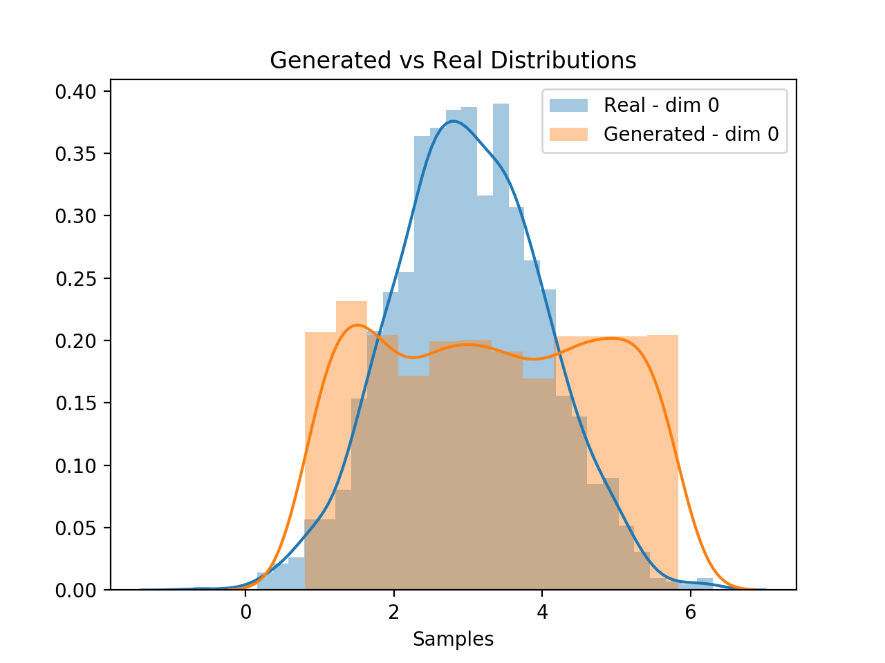
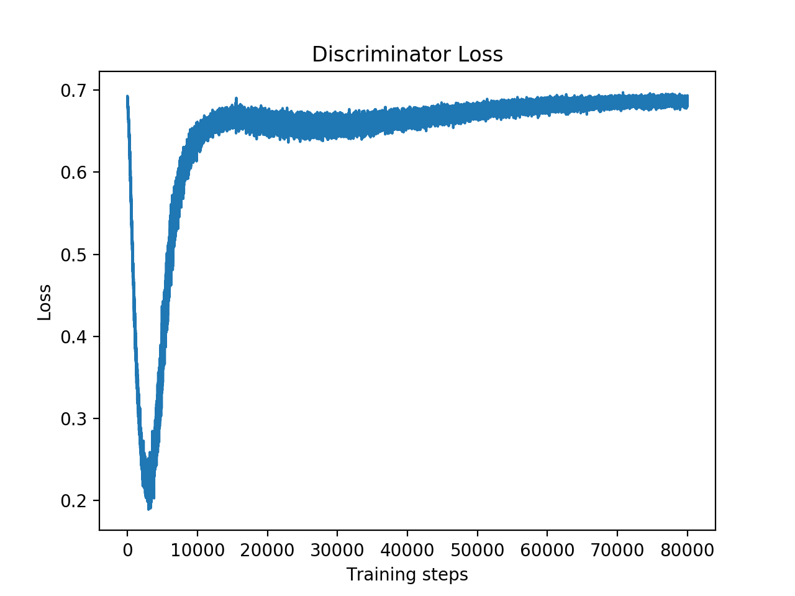
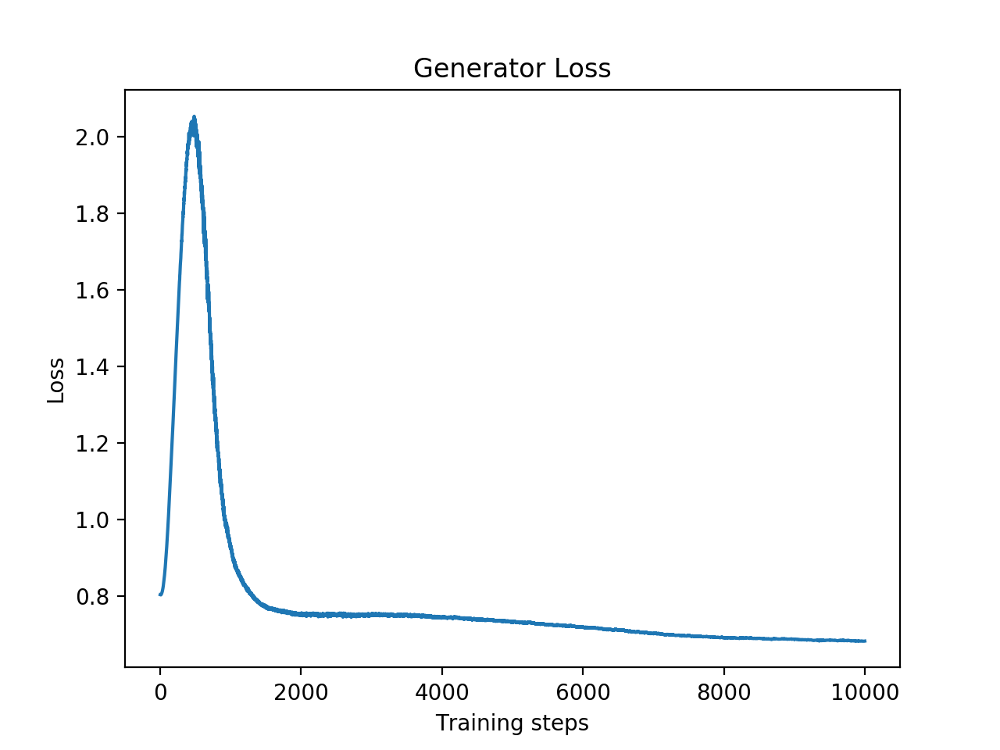

# Vanilla Generative Adversarial Networks
Implementation of the original version of GANs as described in [this paper](https://arxiv.org/abs/1406.2661) by Ian J. Goodfellow, Jean Pouget-Abadie, Mehdi Mirza, Bing Xu, David Warde-Farley, Sherjil Ozair, Aaron Courville, Yoshua Bengio.

## Experiment setup
The target distribution was a Normal distribution with mean=3 and std=1, and the input noise to the generator was sampled from a uniform distribution. Boththe target and noise samples are monodimensional, but this can be changed in the config.yml file in order to extend to multiple dimensions.

The discriminator is composed by 2 hidden layers with 16 and 8 neurons respectively, with ReLU activation functions and dropout after each layer with a probability of 0.5. The output layer is composed by only 1 neuron with sigmoid activation function, providing the probability of the input sample belonging to the real distribution and not being generated by the generator.

The generator is composed by 3 hidden layers of sizes 8, 16, 8 relatively, with ReLU activation functions. The output layer has the same size of the number of dimensions of the target samples, so in our case is 1. The output activation function is linear, because we don't want to limit the output values.

## Results

Discriminator Loss                                           |  Generator Loss
:-----------------------------------------------------------:|:---------------------------------------:
 | 